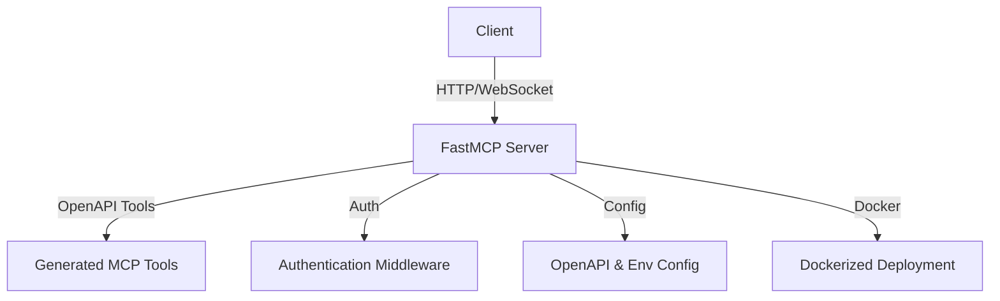
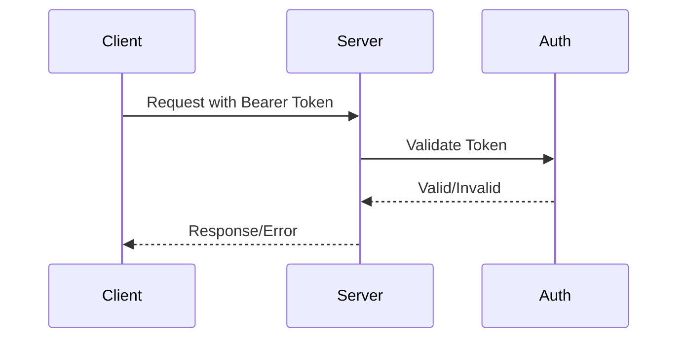
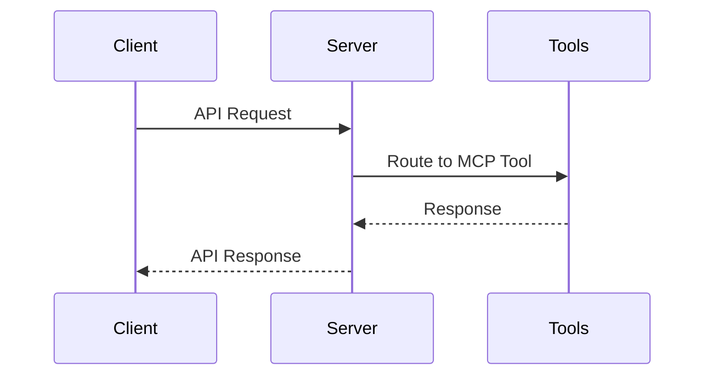
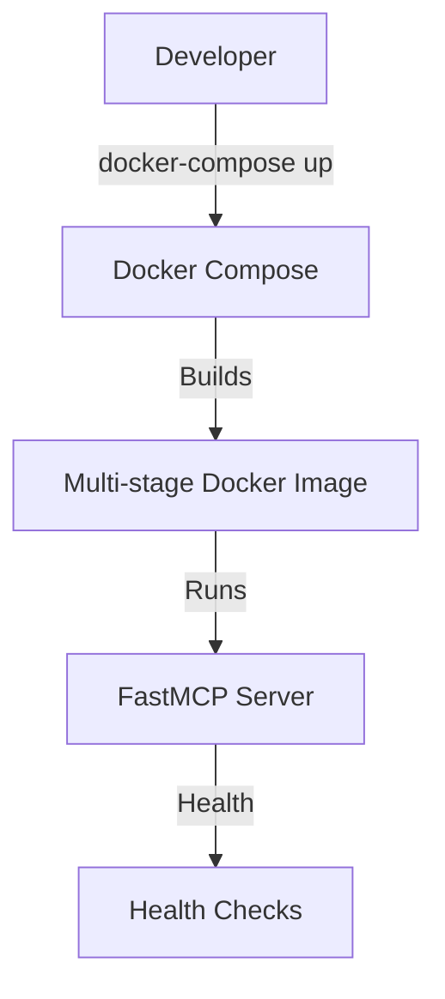

# FastMCP OpenAPI Server

A production-ready FastMCP server implementation generated from an OpenAPI/Swagger specification. This server supports real-time streamable HTTP, Bearer token authentication, OpenAPI-based tool generation, and is optimized for Docker deployment.

## Features
- Auto-generates MCP tools from OpenAPI/Swagger specs
- Streamable HTTP endpoints
- Bearer token & API key authentication
- Multi-stage Docker build for production
- Health checks, logging, and monitoring
- Comprehensive error handling

## Architecture

### System Overview


### Authentication Flow


### Request/Response Flow


### Docker Deployment


## Quick Start

### Prerequisites
- Node.js 18+
- Docker (for containerized deployment)

### Setup
```sh
cp config/.env.example config/.env
cp config/openapi.example.json config/openapi.json
npm install
```

### Run Locally
```sh
npm run dev
```

### Run with Docker
```sh
docker-compose up --build
```

## Configuration
- See `config/.env.example` for environment variables
- Place your OpenAPI spec in `config/openapi.json`

## Deployment
- See `docs/deployment.md` for full deployment guide

## API Documentation
- See `docs/api-reference.md` for auto-generated API docs

## Security
- Bearer token validation
- API key management
- CORS & security headers
- Audit logging

## Example Usage
- Load OpenAPI spec: `config/openapi.json`
- Configure tokens: `config/.env`
- Start server: `npm run dev` or Docker
- Make authenticated API calls with Bearer token

---

For more details, see the `docs/` directory.
