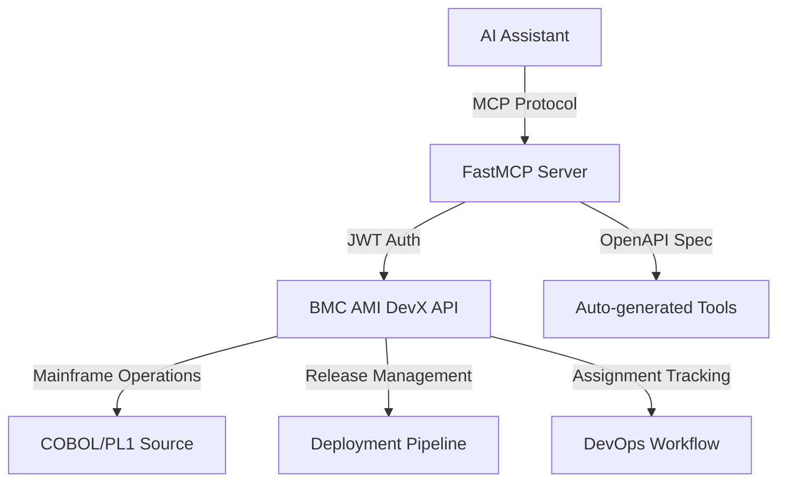
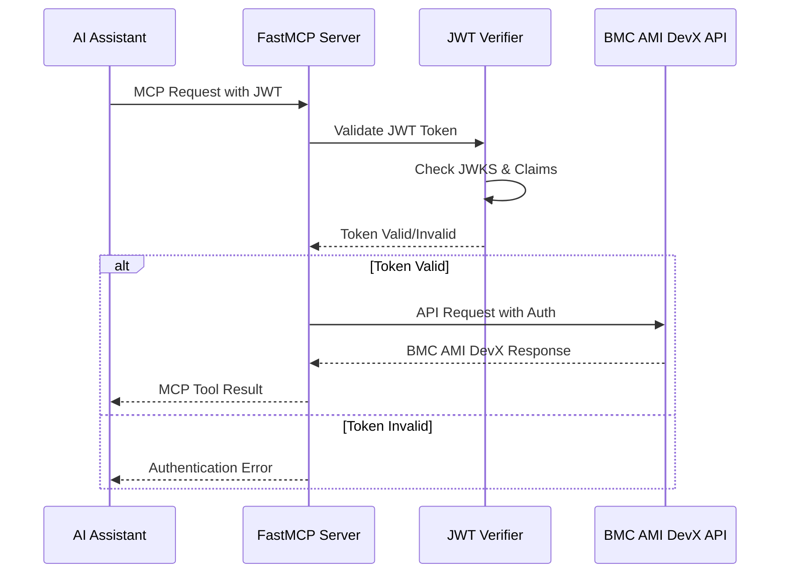
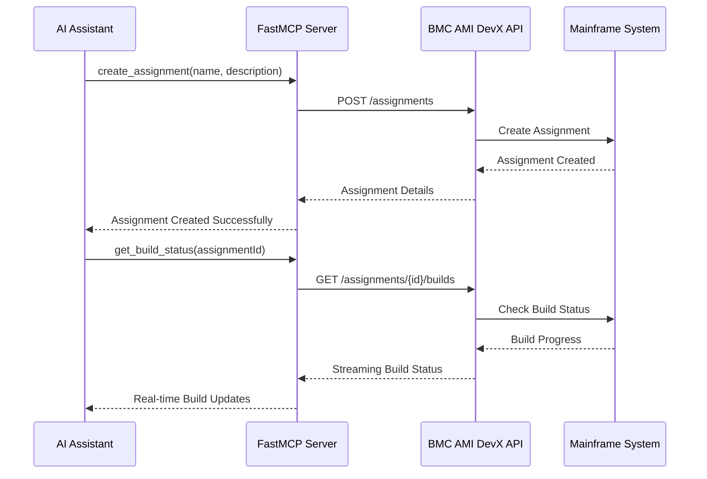

[](https://www.python.org/downloads/)
[](https://gofastmcp.com/)
[](https://github.com/markbsigler/CodePipeline-FastMCP/actions)

A **FastMCP 2.x standards-compliant** Model Context Protocol (MCP) server for **BMC AMI DevX Code Pipeline** mainframe DevOps operations. This server follows official FastMCP best practices, uses built-in authentication providers, and implements Streamable HTTP transport for real-time capabilities.

## Features

### FastMCP 2.x Compliance
- ✅ **Built-in Authentication**: JWT verification using FastMCP's `JWTVerifier`
- ✅ **Streamable HTTP Transport**: FastMCP's recommended transport protocol
- ✅ **OpenAPI Integration**: Auto-generates MCP tools from BMC AMI DevX Code Pipeline API spec
- ✅ **Standards Compliance**: Follows `FASTMCP_` environment variable conventions
- ✅ **Production Ready**: Health checks, logging, and Docker deployment

### BMC AMI DevX Code Pipeline Integration
- **Assignment Management**: Create, list, update, and track mainframe assignments
- **Release Operations**: Manage release lifecycles and promotions
- **Source Code Management**: Handle COBOL, PL/I, and other mainframe source code
- **Real-time Updates**: Streaming build and deployment status via FastMCP
- **Mainframe DevOps**: Complete CI/CD pipeline integration

## How it Works

FastMCP reads the BMC AMI DevX Code Pipeline OpenAPI 3.x specification from `config/openapi.json` and auto-generates MCP tools for each operation. The server uses FastMCP's built-in Streamable HTTP transport to provide real-time capabilities and JWT authentication for enterprise security.



## BMC AMI DevX Code Pipeline OpenAPI Specification

The server uses the BMC AMI DevX Code Pipeline OpenAPI 3.x specification located in `config/openapi.json`. This spec defines mainframe DevOps operations including:

- **Assignment Operations**: Create, list, update assignments for mainframe development
- **Release Management**: Manage release lifecycles, promotions, and deployments
- **Source Code Operations**: Handle COBOL, PL/I, JCL, and other mainframe source files
- **Build Operations**: Trigger and monitor mainframe compilation and builds
- **Deployment Operations**: Deploy applications to mainframe environments

### OpenAPI Requirements

- Each operation must have a unique `operationId`
- Operations are auto-mapped to MCP tools (e.g., `createAssignment` → `create_assignment`)
- Authentication headers are handled automatically by FastMCP's JWT verifier
- Real-time operations use FastMCP's Streamable HTTP for progress updates

## Environment Configuration

The server follows FastMCP 2.x environment variable standards with the `FASTMCP_` prefix:

### FastMCP Authentication (Production)
```bash
# JWT Authentication (recommended)
FASTMCP_SERVER_AUTH=JWT
FASTMCP_SERVER_AUTH_JWT_JWKS_URI=https://auth.bmc.com/.well-known/jwks.json
FASTMCP_SERVER_AUTH_JWT_ISSUER=https://auth.bmc.com/
FASTMCP_SERVER_AUTH_JWT_AUDIENCE=bmc-ami-devx-code-pipeline
```

### Server Configuration
```bash
HOST=127.0.0.1
PORT=8080
LOG_LEVEL=INFO
API_BASE_URL=https://devx.bmc.com/code-pipeline/api/v1
```

### BMC AMI DevX Code Pipeline Specific
```bash
BMC_AMI_DEVX_ENVIRONMENT=production
BMC_AMI_DEVX_TIMEOUT=30
BMC_AMI_DEVX_RETRY_ATTEMPTS=3
BMC_AMI_DEVX_MAX_CONCURRENT_REQUESTS=10
```

## Troubleshooting
- **404 on tool calls:** No backend is implemented for the endpoint. Add a handler in your server.
- **Tool not found:** Check your OpenAPI spec for correct `operationId` and path.
- **Dependency issues:** Ensure you are using Python 3.11+ and have installed all requirements.

## Contributing
- Fork the repo and create a feature branch.
- Follow PEP8 and existing code style.
- Add or update tests for new features.
- Open a pull request with a clear description.

## Example API Calls
```sh
curl -H "Authorization: Bearer <token>" http://localhost:8080/mcp/get_users
```
Or in Python:
```python
import httpx
resp = httpx.get("http://localhost:8080/mcp/get_users", headers={"Authorization": "Bearer <token>"})
print(resp.json())
```

## Quick Start

### Prerequisites

- Python 3.11+
- Docker (for containerized deployment)
- BMC AMI DevX Code Pipeline access (for production use)

### Local Development Setup

```bash
# Clone the repository
git clone https://github.com/markbsigler/CodePipeline-FastMCP.git
cd CodePipeline-FastMCP

# Create virtual environment
python3 -m venv .venv
source .venv/bin/activate

# Install dependencies
pip install -r requirements.txt

# Configure environment (copy and edit)
cp config/.env.example config/.env
# Edit config/.env with your BMC AMI DevX Code Pipeline settings
```

### Run FastMCP Server

```bash
# Development mode (no authentication)
FASTMCP_SERVER_AUTH=NONE python main.py

# Production mode (with JWT authentication)
python main.py
```

The server will start on `http://localhost:8080` with the following endpoints:

- **MCP Endpoint**: `http://localhost:8080/mcp/` (Streamable HTTP transport)
- **Health Check**: `http://localhost:8080/health`
- **Available Tools**: Auto-generated from BMC AMI DevX Code Pipeline OpenAPI spec

### Docker Deployment

```bash
# Build and run with Docker Compose
docker-compose up --build

# Or build Docker image manually
docker build -t fastmcp-code-pipeline .
docker run -p 8080:8080 -e FASTMCP_SERVER_AUTH=NONE fastmcp-code-pipeline
```

### Testing the Server

```bash
# Check server health
curl http://localhost:8080/health

# List available MCP tools (requires MCP client)
# Tools are auto-generated from config/openapi.json
```

## MCP Tools Available

The server auto-generates MCP tools from the BMC AMI DevX Code Pipeline OpenAPI specification:

### Assignment Management Tools
- `create_assignment` - Create new mainframe development assignments
- `list_assignments` - List user assignments with filtering
- `get_assignment_details` - Get detailed assignment information
- `update_assignment_status` - Update assignment progress and status

### Release Management Tools
- `create_release` - Create new release for deployment
- `promote_release` - Promote release through lifecycle stages
- `list_releases` - List available releases with status
- `get_release_status` - Get detailed release information

### Source Code Management Tools
- `list_programs` - List programs in assignment or release
- `get_program_content` - Retrieve COBOL, PL/I, JCL source code
- `update_program` - Update source code with version control
- `generate_program` - AI-assisted code generation

### Build and Deployment Tools
- `trigger_build` - Start mainframe compilation and build
- `get_build_status` - Monitor build progress in real-time
- `deploy_application` - Deploy to mainframe environments
- `get_deployment_status` - Track deployment progress

## Security and Authentication

The server implements enterprise-grade security following FastMCP 2.x standards:

- **JWT Authentication**: Using FastMCP's built-in `JWTVerifier`
- **JWKS Support**: Automatic key rotation and validation
- **Token Introspection**: Remote token validation support
- **Environment-based Config**: Secure configuration management
- **HTTPS Support**: TLS termination via reverse proxy

## Production Deployment

For production deployment with BMC AMI DevX Code Pipeline:

1. **Configure JWT Authentication**: Set up JWKS URI and issuer
2. **Set API Base URL**: Point to your BMC AMI DevX Code Pipeline instance
3. **Deploy with Docker**: Use provided Docker Compose configuration
4. **Monitor Health**: Use `/health` endpoint for monitoring
5. **Configure Logging**: Set appropriate log levels for production

## Troubleshooting

### Common Issues

- **Authentication Errors**: Verify JWT configuration and JWKS URI accessibility
- **Connection Issues**: Check API_BASE_URL and network connectivity to BMC AMI DevX
- **Tool Not Found**: Verify OpenAPI spec contains required operationId
- **Performance Issues**: Adjust timeout and retry settings for mainframe operations

### Debug Mode

```bash
# Enable debug logging
LOG_LEVEL=DEBUG python main.py

# Disable authentication for testing
FASTMCP_SERVER_AUTH=NONE python main.py
```

## Architecture Diagrams

### FastMCP Authentication Flow



### BMC AMI DevX Code Pipeline Integration



### Container Architecture

```mermaid
flowchart TB
    subgraph "Docker Container"
        FastMCP[FastMCP Server<br/>Python 3.11]
        Config[config/openapi.json<br/>BMC AMI DevX Spec]
        Health[/health endpoint]
    end

    subgraph "External Systems"
        AI[AI Assistant<br/>MCP Client]
        JWT[JWT Provider<br/>JWKS Endpoint]
        BMC[BMC AMI DevX<br/>Code Pipeline API]
        Mainframe[Mainframe<br/>COBOL/PL1/JCL]
    end

    AI -->|MCP Protocol| FastMCP
    FastMCP -->|JWT Validation| JWT
    FastMCP -->|API Requests| BMC
    BMC -->|DevOps Operations| Mainframe
    FastMCP -->|Health Check| Health
    Config -->|OpenAPI Spec| FastMCP
```
