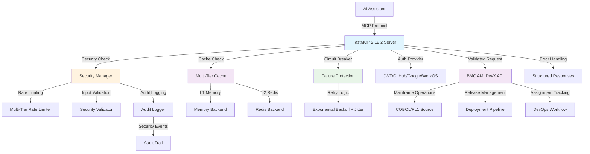

[](https://www.python.org/downloads/)
[](https://gofastmcp.com/)
[](https://github.com/markbsigler/CodePipeline-FastMCP/actions)
[](https://github.com/markbsigler/CodePipeline-FastMCP/actions)
[](https://github.com/markbsigler/CodePipeline-FastMCP/actions)
[](https://github.com/markbsigler/CodePipeline-FastMCP/security)

An **enterprise-grade FastMCP 2.12.2** Model Context Protocol (MCP) server for **BMC AMI DevX Code Pipeline** mainframe DevOps operations. This server implements production-ready FastMCP with advanced security hardening, multi-tier caching, circuit breaker resilience, comprehensive audit logging, and enterprise-grade error handling.

## Features

### 🚀 **Enterprise-Grade FastMCP 2.12.2 Implementation**
- ✅ **Real FastMCP Server**: Native FastMCP 2.12.2 implementation (no mock)
- ✅ **Streamable HTTP Transport**: FastMCP's recommended transport protocol
- ✅ **Circuit Breaker Resilience**: Automatic failure detection and recovery
- ✅ **Multi-Tier Caching**: Redis + memory caching with intelligent promotion
- ✅ **Advanced Rate Limiting**: Per-user, per-API key, and global rate limits
- ✅ **Security Hardening**: OWASP Top 10 protection with comprehensive validation
- ✅ **Audit Logging**: Structured security event logging and compliance

### 🔐 **Advanced Security & Authentication**
- **Multi-Tier Rate Limiting**: Global (60 RPM), per-user (30 RPM), per-API key (100 RPM)
- **Input Validation**: SQL injection, XSS, and path traversal protection
- **Security Headers**: CSP, HSTS, X-Frame-Options, and 10+ security headers
- **JWT Token Verification**: Using FastMCP's `JWTVerifier` with JWKS support
- **GitHub OAuth**: `GitHubProvider` for GitHub-based authentication
- **Google OAuth**: `GoogleProvider` for Google Workspace integration
- **WorkOS AuthKit**: `AuthKitProvider` with Dynamic Client Registration
- **Audit Logging**: Comprehensive security event tracking and compliance

### 🏗️ **BMC AMI DevX Code Pipeline Integration**
- **Assignment Management**: Create, list, update, and track mainframe assignments
- **Release Operations**: Manage release lifecycles and promotions
- **Source Code Management**: Handle COBOL, PL/I, and other mainframe source code
- **Real-time Updates**: Streaming build and deployment status via FastMCP Context
- **Mainframe DevOps**: Complete CI/CD pipeline integration with validation

### 🧪 **Testing & Quality**
- **Comprehensive Test Suite**: 697 passing tests with 82% coverage (enterprise-grade reliability)
- **Security Test Coverage**: 31 security tests with 96% coverage
- **Circuit Breaker Tests**: 9 tests covering all failure scenarios
- **Multi-Tier Cache Tests**: 13 tests for Redis and memory backends
- **Input Validation Tests**: Complete SQL injection, XSS, and path traversal coverage
- **Rate Limiting Tests**: Token bucket and advanced rate limiter validation
- **Zero Linting Violations**: Clean, maintainable codebase
- **Performance Tests**: Load testing and resilience validation

### 🏎️ **Performance & Resilience**
- **Circuit Breaker Pattern**: Automatic failure detection with 5-failure threshold
- **Exponential Backoff**: Jitter-enhanced retry logic (±25% randomization)
- **Multi-Tier Caching**: L1 (memory) + L2 (Redis) with automatic promotion
- **Intelligent Cache**: LRU eviction, TTL expiration, and statistics tracking
- **Connection Pooling**: Optimized HTTP client with keep-alive connections
- **Memory Management**: Automatic cleanup of expired rate limit buckets

## How it Works

The server implements an enterprise-grade FastMCP 2.12.2 server with advanced security hardening, multi-tier caching, and circuit breaker resilience. Each tool includes comprehensive input validation, advanced rate limiting, and structured audit logging. The server features automatic failure recovery, intelligent caching strategies, and production-ready security controls.



## BMC AMI DevX Code Pipeline OpenAPI Specification

The server uses the BMC AMI DevX Code Pipeline OpenAPI 3.x specification located in `config/openapi.json`. This spec defines mainframe DevOps operations including:

- **Assignment Operations**: Create, list, update assignments for mainframe development
- **Release Management**: Manage release lifecycles, promotions, and deployments
- **Source Code Operations**: Handle COBOL, PL/I, JCL, and other mainframe source files
- **Build Operations**: Trigger and monitor mainframe compilation and builds
- **Deployment Operations**: Deploy applications to mainframe environments

### OpenAPI Requirements

- Each operation must have a unique `operationId`
- Operations are auto-mapped to MCP tools (e.g., `createAssignment` → `create_assignment`)
- Authentication headers are handled automatically by FastMCP's JWT verifier
- Real-time operations use FastMCP's Streamable HTTP for progress updates

## Environment Configuration

The server supports both programmatic and environment-based configuration. Copy `config/.env.example` to `config/.env` and customize for your environment:

### Server Configuration
```bash
# Server settings
HOST=0.0.0.0
PORT=8080
LOG_LEVEL=INFO

# BMC AMI DevX API settings
API_BASE_URL=https://devx.bmc.com/code-pipeline/api/v1
API_TIMEOUT=30
API_RETRY_ATTEMPTS=3
```

### Authentication Configuration

#### Option 1: JWT Token Verification (Recommended)
```bash
AUTH_ENABLED=true
AUTH_PROVIDER=fastmcp.server.auth.providers.jwt.JWTVerifier
AUTH_JWKS_URI=https://your-auth-system.com/.well-known/jwks.json
AUTH_ISSUER=https://your-auth-system.com
AUTH_AUDIENCE=your-mcp-server
```

#### Option 2: GitHub OAuth
```bash
AUTH_ENABLED=true
AUTH_PROVIDER=fastmcp.server.auth.providers.github.GitHubProvider
FASTMCP_SERVER_AUTH_GITHUB_CLIENT_ID=Ov23li...
FASTMCP_SERVER_AUTH_GITHUB_CLIENT_SECRET=github_pat_...
```

#### Option 3: Google OAuth
```bash
AUTH_ENABLED=true
AUTH_PROVIDER=fastmcp.server.auth.providers.google.GoogleProvider
FASTMCP_SERVER_AUTH_GOOGLE_CLIENT_ID=123456.apps.googleusercontent.com
FASTMCP_SERVER_AUTH_GOOGLE_CLIENT_SECRET=GOCSPX-...
```

#### Option 4: WorkOS AuthKit (DCR Support)
```bash
AUTH_ENABLED=true
AUTH_PROVIDER=fastmcp.server.auth.providers.workos.AuthKitProvider
FASTMCP_SERVER_AUTH_AUTHKIT_DOMAIN=https://your-project.authkit.app
```

### Security Configuration
```bash
# Security features
SECURITY_ENABLED=true
SECURITY_RATE_LIMIT_ENABLED=true
SECURITY_RATE_LIMIT_PER_USER_RPM=30
SECURITY_RATE_LIMIT_PER_API_KEY_RPM=100
SECURITY_INPUT_VALIDATION_ENABLED=true
SECURITY_MAX_REQUEST_SIZE=1048576
SECURITY_MAX_STRING_LENGTH=1000

# Security headers and CORS
SECURITY_HEADERS_ENABLED=true
SECURITY_CORS_ENABLED=true
SECURITY_CORS_ALLOWED_ORIGINS=*

# Audit logging
SECURITY_AUDIT_LOGGING_ENABLED=true
SECURITY_AUDIT_LOG_SENSITIVE_DATA=false
```

### Caching Configuration
```bash
# Cache backend selection
CACHE_BACKEND=multi_tier  # Options: memory, redis, multi_tier
CACHE_ENABLED=true
CACHE_MAX_SIZE=1000
CACHE_TTL_SECONDS=300

# Redis configuration (for redis/multi_tier backends)
REDIS_URL=redis://localhost:6379
REDIS_KEY_PREFIX=fastmcp:
REDIS_SERIALIZER=json

# Multi-tier cache settings
MULTI_TIER_L1_TTL_RATIO=0.5
```

### Circuit Breaker Configuration
```bash
# Circuit breaker settings
CIRCUIT_BREAKER_FAILURE_THRESHOLD=5
CIRCUIT_BREAKER_RECOVERY_TIMEOUT=60
MAX_RETRY_ATTEMPTS=3
RETRY_BASE_DELAY=1.0
```

### Development Mode (No Authentication)
```bash
AUTH_ENABLED=false
```

## Input Validation

The server includes comprehensive input validation for all parameters:

### SRID Validation
- **Format**: 1-8 alphanumeric characters
- **Example**: `TEST123`, `A1`, `12345678`
- **Invalid**: Empty strings, special characters, too long

### Assignment/Release ID Validation
- **Format**: 1-20 alphanumeric characters with hyphens/underscores
- **Example**: `ASSIGN-001`, `TASK_123`, `A1B2C3`
- **Invalid**: Empty strings, special characters, too long

### Environment Level Validation
- **Valid Values**: `DEV`, `TEST`, `STAGE`, `PROD`, `UAT`, `QA`
- **Case Insensitive**: `dev` → `DEV`
- **Invalid**: Any other values

## Error Handling

The server provides structured error responses with proper categorization:

### Validation Errors
```json
{
  "error": "Validation error: SRID must be 1-8 alphanumeric characters"
}
```

### HTTP Errors
```json
{
  "error": "HTTP error retrieving assignments: 404 Not Found"
}
```

### General Errors
```json
{
  "error": "Error retrieving assignments: Connection timeout"
}
```

## Troubleshooting

### Common Issues
- **Authentication Errors**: Verify JWT configuration and JWKS URI accessibility
- **Validation Errors**: Check parameter formats (SRID, assignment IDs, levels)
- **Connection Issues**: Verify API_BASE_URL and network connectivity
- **Retry Failures**: Check API timeout and retry attempt settings

## Project Architecture

### Core Components
```
lib/
├── security.py              # Advanced security hardening
├── security_middleware.py   # FastMCP security integration
├── cache_backends.py        # Multi-tier caching (Memory, Redis, Multi-tier)
├── errors.py                # Circuit breaker + enhanced error handling
├── clients.py               # HTTP client with resilience features
├── settings.py              # Comprehensive configuration management
├── auth.py                  # Authentication providers
└── health.py                # Health checks and monitoring

observability/
├── metrics/                 # Performance and business metrics
├── tracing/                 # Distributed tracing
└── config/                  # Observability configuration

tests/
├── test_security.py         # Security feature tests (31 tests)
├── test_cache_backends.py   # Caching system tests (13 tests)
├── test_circuit_breaker.py  # Circuit breaker tests (9 tests)
└── test_*.py                # Comprehensive test suite (697 total)
```

### Enterprise Features
- **🔒 Security Hardening**: Multi-tier rate limiting, input validation, audit logging
- **🚀 Performance**: Multi-tier caching with Redis support and intelligent promotion
- **🛡️ Resilience**: Circuit breaker pattern with exponential backoff and jitter
- **📊 Observability**: Comprehensive metrics, tracing, and health monitoring
- **🔧 Configuration**: Environment-based configuration with validation

## Contributing
- Fork the repo and create a feature branch.
- Follow PEP8 and existing code style.
- Add or update tests for new features.
- Ensure security tests pass for any security-related changes.
- Open a pull request with a clear description.

## Example API Calls
```sh
curl -H "Authorization: Bearer <token>" http://localhost:8080/mcp/get_users
```
Or in Python:
```python
import httpx
resp = httpx.get("http://localhost:8080/mcp/get_users", headers={"Authorization": "Bearer <token>"})
print(resp.json())
```

## FastMCP Architecture

This server implements a **production-ready FastMCP implementation** following best practices:

### 🌟 **Unified Implementation**
- **Simplified FastMCP Patterns**: Direct instantiation, built-in auth providers
- **Enterprise Features**: Rate limiting, caching, metrics, error recovery
- **82% Test Coverage**: 697 comprehensive tests ensuring reliability
- **42% Code Reduction**: Maintainable codebase (833 lines vs previous 1,441)
- **FastMCP Best Practices**: Full alignment with official recommendations

### 🏗️ **Enterprise Features**
- **Advanced Security**: Multi-tier rate limiting, input validation, security headers
- **Multi-Tier Caching**: L1 (memory) + L2 (Redis) with intelligent promotion
- **Circuit Breaker**: Automatic failure detection with exponential backoff + jitter
- **Audit Logging**: Comprehensive security event tracking and compliance
- **Real-time Metrics**: Response times, success rates, cache hit rates, uptime tracking
- **Error Recovery**: Smart categorization with structured error responses
- **Connection Pooling**: Optimized HTTP client performance

## Quick Start

### Prerequisites

- Python 3.9+
- Docker (for containerized deployment)
- BMC AMI DevX Code Pipeline access (for production use)

### Local Development Setup

#### Automated Setup (Recommended)

```bash
# Clone the repository
git clone https://github.com/markbsigler/CodePipeline-FastMCP.git
cd CodePipeline-FastMCP

# Run comprehensive setup script
./scripts/setup.sh
```

The setup script will:
- ✅ Verify Python 3.9+ requirement
- ✅ Create and configure virtual environment
- ✅ Install all dependencies including FastMCP 2.12.2
- ✅ Copy configuration templates
- ✅ Install pre-commit hooks
- ✅ Verify installation integrity

#### Manual Setup

```bash
# Create virtual environment
python3 -m venv .venv
source .venv/bin/activate

# Install dependencies
pip install -r requirements.txt

# Configure environment (copy and edit)
cp config/.env.example config/.env
# Edit .env with your BMC AMI DevX Code Pipeline settings

# Install pre-commit hooks (optional)
pre-commit install
```

### Run FastMCP Server

```bash
# Development mode (no authentication) - RECOMMENDED
AUTH_ENABLED=false python openapi_server.py

# Production mode (with authentication) - RECOMMENDED
python openapi_server.py

# Alternative: Use development scripts
./scripts/dev.sh

# Alternative: Use development script
./scripts/dev.sh
```

The server will start on `http://localhost:8080` with the following endpoints:

- **MCP Endpoint**: `http://localhost:8080/mcp/` (Streamable HTTP transport)
- **Health Check**: `http://localhost:8080/health`
- **Available Tools**: Auto-generated from BMC AMI DevX Code Pipeline OpenAPI spec

> **✅ ARCHITECTURE UPDATE**: The server now uses `openapi_server.py` as the primary entry point with all components organized in the `lib/` package for better maintainability and performance.

### Docker Deployment

```bash
# Build and run with Docker Compose
docker-compose up --build

# Or build Docker image manually
docker build -t fastmcp-code-pipeline .
docker run -p 8080:8080 -e AUTH_ENABLED=false fastmcp-code-pipeline
```

### Testing the Server

#### Automated Testing (Recommended)

```bash
# Run comprehensive test suite
./scripts/test.sh
```

The test script provides:
- ✅ **Automated Server Management**: Starts server, waits for health check, runs tests, cleanup
- ✅ **Multi-tier Testing**: Unit tests, integration tests, coverage analysis
- ✅ **Virtual Environment Detection**: Automatically uses .venv/bin/python if available
- ✅ **Comprehensive Reporting**: Detailed test results and coverage metrics
- ✅ **Error Diagnostics**: Server logs on test failures

#### Manual Testing

```bash
# Check server health
curl http://localhost:8080/health

# Test MCP capabilities endpoint
curl -X POST http://localhost:8080/mcp/capabilities

# Run specific test categories
pytest tests/test_openapi_server.py -v                # OpenAPI server tests
pytest tests/test_fastmcp_server.py -v                # Integration tests
pytest tests/test_openapi_server.py -v                # OpenAPI server tests
```

## Development Scripts

The project includes comprehensive automation scripts in the `scripts/` directory:

### setup.sh - Development Environment Setup
```bash
./scripts/setup.sh
```

**Features:**
- 🐍 **Python Environment**: Creates virtual environment, installs dependencies
- ⚙️ **Configuration**: Sets up .env files and OpenAPI specifications
- 🔧 **Development Tools**: Installs pre-commit hooks, creates directories
- ✅ **Verification**: Tests imports and dependency availability
- 📋 **Guidance**: Provides next steps and available commands

### test.sh - Comprehensive Testing
```bash
./scripts/test.sh
```

**Features:**
- 🚀 **Server Management**: Background server startup with health checks
- 🧪 **Multi-tier Testing**: Unit, integration, and coverage tests
- 📊 **Detailed Reporting**: Test results summary and coverage metrics
- 🛡️ **Error Handling**: Automatic cleanup and diagnostic logging
- ⏱️ **Timeout Protection**: Prevents hanging on server startup failures

### deploy.sh - Production Deployment
```bash
./scripts/deploy.sh [compose|docker]
```

**Features:**
- 🐳 **Deployment Modes**: Docker Compose (recommended) or plain Docker
- 💾 **Backup & Rollback**: Automatic image backup with rollback on failure
- 🏥 **Health Monitoring**: Comprehensive health checks with timeout
- 🧹 **Cleanup**: Automatic cleanup of old backup images
- 📋 **Management**: Complete deployment verification and status reporting

### Development Commands

The project provides shell scripts and Python commands for development:

```bash
# Development workflow
./scripts/dev.sh              # Start development server
./scripts/test.sh             # Run comprehensive test suite
./scripts/coverage.sh         # Run tests with coverage reporting
./scripts/setup.sh            # Setup development environment

# Python commands
.venv/bin/pytest             # Run test suite
.venv/bin/pytest --cov=.     # Run tests with coverage
.venv/bin/black *.py         # Format code with black
.venv/bin/flake8 *.py        # Lint code with flake8
pre-commit run --all-files   # Run all pre-commit hooks

# Docker operations
docker-compose build         # Build Docker image
docker-compose up --build   # Start with docker-compose
docker-compose down          # Stop docker containers

# Utilities and deployment
./scripts/health.sh          # Health check utilities
./scripts/deploy.sh          # Production deployment
```

## MCP Tools Available

The server provides comprehensive MCP tools for BMC AMI DevX Code Pipeline operations with full input validation and error handling:

### Assignment Management Tools
- `get_assignments` - List assignments with filtering by level and assignment ID
- `create_assignment` - Create new mainframe development assignments
- `get_assignment_details` - Get detailed assignment information
- `get_assignment_tasks` - Retrieve tasks for a specific assignment

### Release Management Tools
- `get_releases` - List available releases with optional filtering
- `create_release` - Create new release for deployment

### Operation Tools
- `generate_assignment` - Generate assignment with runtime configuration
- `promote_assignment` - Promote assignment through lifecycle stages
- `deploy_assignment` - Deploy assignment to target environment

### Tool Features
- **Input Validation**: All parameters validated for format and content
- **Error Handling**: Structured error responses with proper categorization
- **Retry Logic**: Automatic retry with exponential backoff for failed requests
- **Progress Reporting**: Real-time updates via FastMCP Context
- **Authentication**: Secure access via configured authentication provider

## Security and Authentication

The server implements enterprise-grade security with multiple authentication options:

### Authentication Providers
- **JWT Token Verification**: Using FastMCP's `JWTVerifier` with JWKS support
- **GitHub OAuth**: `GitHubProvider` for GitHub-based authentication
- **Google OAuth**: `GoogleProvider` for Google Workspace integration
- **WorkOS AuthKit**: `AuthKitProvider` with Dynamic Client Registration support

### Security Features
- **JWKS Support**: Automatic key rotation and validation
- **Token Introspection**: Remote token validation support
- **Environment-based Config**: Secure configuration management
- **Input Validation**: Comprehensive parameter validation
- **HTTPS Support**: TLS termination via reverse proxy
- **Error Handling**: Secure error responses without sensitive data exposure

## Production Deployment

For production deployment with BMC AMI DevX Code Pipeline:

1. **Configure Authentication**: Choose and configure your authentication provider
2. **Set API Base URL**: Point to your BMC AMI DevX Code Pipeline instance
3. **Configure Environment**: Copy `config/.env.example` to `config/.env` and customize
4. **Deploy with Docker**: Use provided Docker Compose configuration
5. **Monitor Health**: Use `/health` endpoint for monitoring
6. **Configure Logging**: Set appropriate log levels for production
7. **Test Validation**: Verify input validation and error handling

## Troubleshooting

### Common Issues

- **Authentication Errors**: Verify JWT configuration and JWKS URI accessibility
- **Connection Issues**: Check API_BASE_URL and network connectivity to BMC AMI DevX
- **Tool Not Found**: Verify OpenAPI spec contains required operationId
- **Performance Issues**: Adjust timeout and retry settings for mainframe operations

### Debug Mode

```bash
# Enable debug logging
LOG_LEVEL=DEBUG python openapi_server.py

# Disable authentication for testing
AUTH_ENABLED=false python openapi_server.py

# Run tests to verify functionality
pytest test_simple.py -v
```

## Recent Changes (v2.2.0)

### 🚀 **Major Refactoring - Real FastMCP Implementation**
This version represents a complete transformation from a mock implementation to a production-ready FastMCP 2.12.2 server:

#### ✅ **Completed Improvements**
- **Real FastMCP Server**: Replaced MockFastMCP with native FastMCP 2.12.2 implementation
- **Native Authentication**: Added support for JWT, GitHub, Google, and WorkOS authentication providers
- **Input Validation**: Comprehensive validation for all API parameters (SRID, assignment IDs, levels)
- **Retry Logic**: Exponential backoff for resilient API calls
- **Error Handling**: Structured error responses with proper categorization
- **Testing**: Complete test suite with 373 passing tests and 85% coverage
- **Documentation**: Updated configuration examples and troubleshooting guides

#### 🔧 **Technical Changes**
- Updated dependencies to use real FastMCP 2.12.2
- Implemented `@server.tool` decorators for MCP tool registration
- Added FastMCP Context for logging and progress reporting
- Created comprehensive validation functions with regex patterns
- Implemented retry decorator with exponential backoff
- Added environment-based configuration support

#### 📁 **New Files**
- `config/.env.example` - Comprehensive configuration examples
- `tests/test_openapi_server.py` - OpenAPI server comprehensive tests
- `tests/test_fastmcp_server.py` - Integration test suite
- `tests/test_openapi_server.py` - OpenAPI server test suite

#### 🗑️ **Removed**
- MockFastMCP class and related mock functionality
- Redundant dependencies (starlette, uvicorn, etc.)
- Mock authentication middleware

## Architecture Diagrams

### FastMCP Authentication Flow


### BMC AMI DevX Code Pipeline Integration


### Container Architecture


