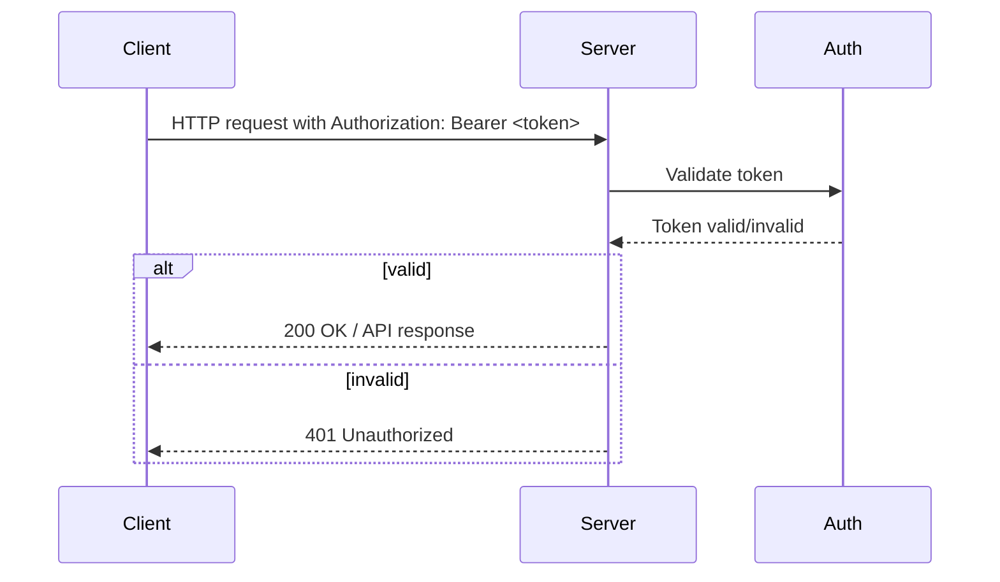
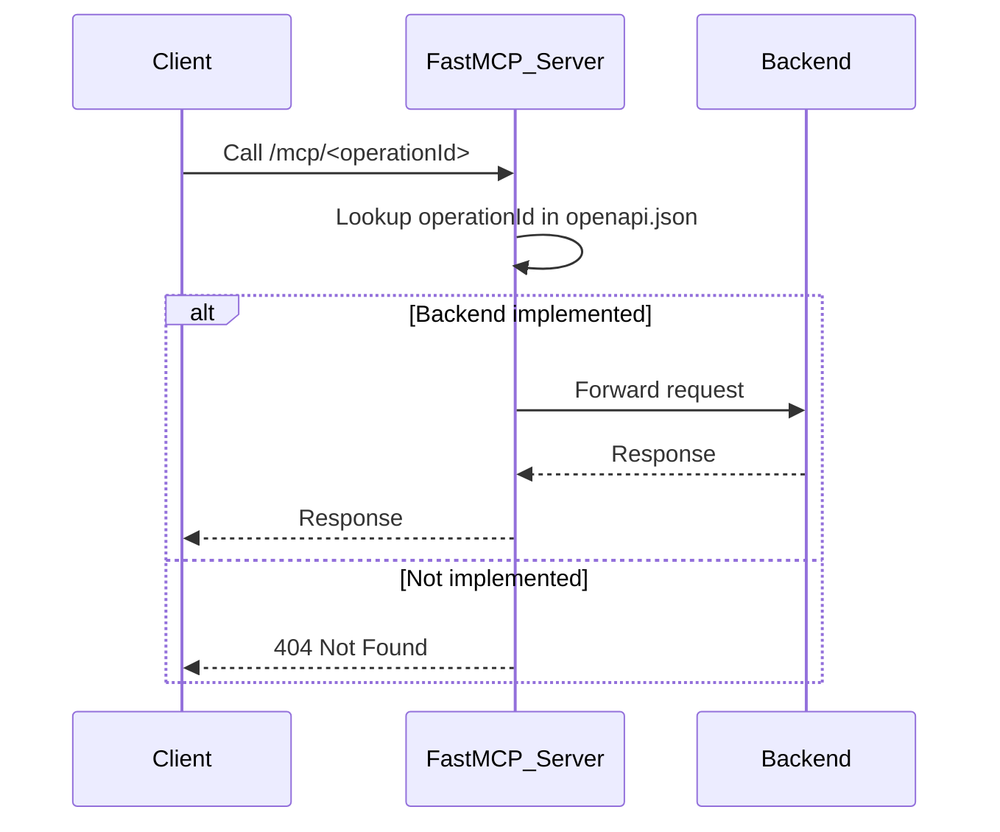
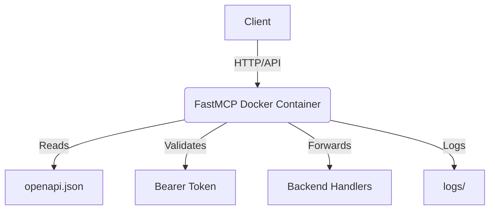

# FastMCP Architecture Diagrams

## Authentication with Bearer Token

```mermaid
sequenceDiagram
    participant Client
    participant Server
    participant Auth
    Client->>Server: HTTP request with Authorization: Bearer <token>
    Server->>Auth: Validate token
    Auth-->>Server: Token valid/invalid
    alt valid
        Server-->>Client: 200 OK / API response
    else invalid
        Server-->>Client: 401 Unauthorized
    end
```

## OpenAPI Endpoints Flow

```mermaid
sequenceDiagram
    participant Client
    participant FastMCP_Server
    participant Backend
    Client->>FastMCP_Server: Call /mcp/<operationId>
    FastMCP_Server->>FastMCP_Server: Lookup operationId in openapi.json
    alt Backend implemented
        FastMCP_Server->>Backend: Forward request
        Backend-->>FastMCP_Server: Response
        FastMCP_Server-->>Client: Response
    else Not implemented
        FastMCP_Server-->>Client: 404 Not Found
    end
```

## Container Deployment Overview

```mermaid
flowchart TD
    A[Client] -->|HTTP/API| B(FastMCP Docker Container)
    B -->|Reads| C[openapi.json]
    B -->|Validates| D[Bearer Token]
    B -->|Forwards| E[Backend Handlers]
    B -->|Logs| F[logs/]
```
