# BMC AMI DevX Code Pipeline MCP Server - Architecture Diagrams

## 🚀 **FastMCP Server Initialization Flow**


## 🔐 **Multi-Provider Authentication Flow**


## 🔧 **OpenAPI Tool Generation Process**

```mermaid
flowchart TD
    subgraph "Initialization Phase"
        OpenAPI_Spec[config/openapi.json] --> Parser[OpenAPI Parser]
        Parser --> Schema_Validation[Schema Validation]
        Schema_Validation --> Tool_Generation[Auto Tool Generation]
    end

    subgraph "Tool Creation"
        Tool_Generation --> Assignment_Tools[Assignment Management Tools]
        Tool_Generation --> Release_Tools[Release Operation Tools]
        Tool_Generation --> Package_Tools[Package Management Tools]
        Tool_Generation --> Build_Tools[Build & Deployment Tools]
        Tool_Generation --> Source_Tools[Source Code Management Tools]
    end

    subgraph "FastMCP Integration"
        Assignment_Tools --> FastMCP_Mount[FastMCP.mount()]
        Release_Tools --> FastMCP_Mount
        Package_Tools --> FastMCP_Mount
        Build_Tools --> FastMCP_Mount
        Source_Tools --> FastMCP_Mount

        FastMCP_Mount --> Server_Ready[20+ OpenAPI Tools Available]
    end

    subgraph "Custom Extensions"
        Server_Ready --> Custom_Tools[8 Custom Management Tools]
        Server_Ready --> Elicitation_Tools[3 Interactive Elicitation Tools]
        Server_Ready --> Custom_Routes[4 Custom HTTP Routes]
        Server_Ready --> Resource_Templates[Resource Templates]
        Server_Ready --> Prompt_System[Prompt System]
    end

    Custom_Tools --> Production_Server[Production-Ready Server]
    Elicitation_Tools --> Production_Server
    Custom_Routes --> Production_Server
    Resource_Templates --> Production_Server
    Prompt_System --> Production_Server
```

## 💬 **User Elicitation Interaction Flow**

```mermaid
sequenceDiagram
    participant User
    participant MCP_Client
    participant FastMCP_Server
    participant Elicitation_Tool
    participant BMC_API

    User->>MCP_Client: Request Interactive Tool
    MCP_Client->>FastMCP_Server: Call elicitation tool
    FastMCP_Server->>Elicitation_Tool: Execute with context

    Elicitation_Tool->>User: ctx.info("Starting workflow...")

    loop Multi-Step Input Collection
        Elicitation_Tool->>User: ctx.elicit("Input prompt", type)
        User-->>Elicitation_Tool: AcceptedElicitation(data)

        alt User Accepts
            Elicitation_Tool->>Elicitation_Tool: Store input & continue
        else User Declines
            Elicitation_Tool-->>FastMCP_Server: DeclinedElicitation error
        else User Cancels
            Elicitation_Tool-->>FastMCP_Server: CancelledElicitation error
        end
    end

    Elicitation_Tool->>User: ctx.elicit("Confirm: [summary]", None)
    User-->>Elicitation_Tool: AcceptedElicitation()

    Elicitation_Tool->>BMC_API: Execute actual operation
    BMC_API-->>Elicitation_Tool: Operation result

    Elicitation_Tool-->>FastMCP_Server: Success response with data
    FastMCP_Server-->>MCP_Client: Tool result
    MCP_Client-->>User: Operation completed ✅
```



## 🌊 **Request Processing Pipeline**


## 🔄 **Caching & Performance Architecture**


## 🏭 **Production Deployment Flow**


## 📊 **Monitoring & Observability Flow**


## 🔒 **Security & Compliance Architecture**


## 🔧 **Configuration Management Flow**


These comprehensive architecture diagrams provide detailed visual representation of all aspects of the BMC AMI DevX Code Pipeline MCP Server implementation using FastMCP 2.x standards.
