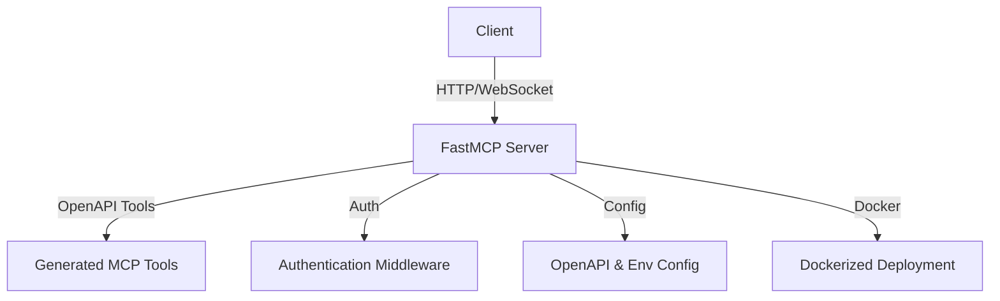
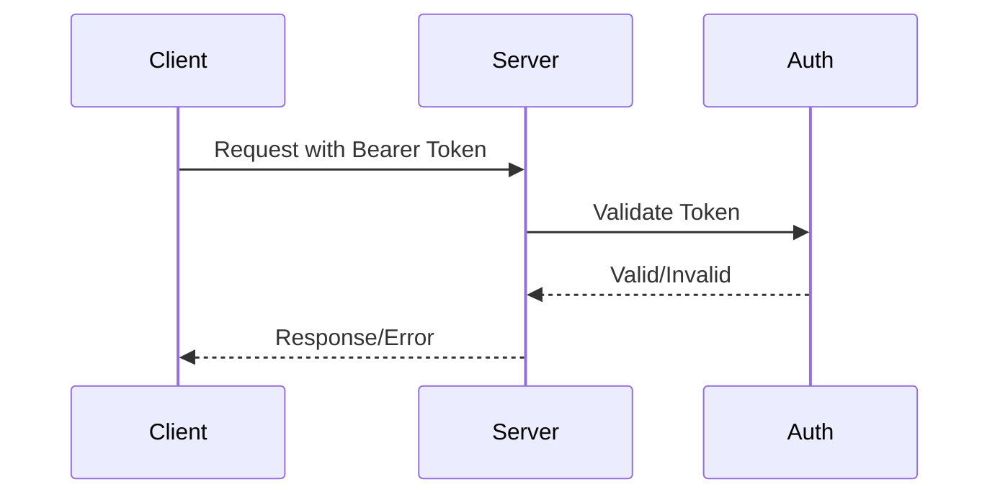
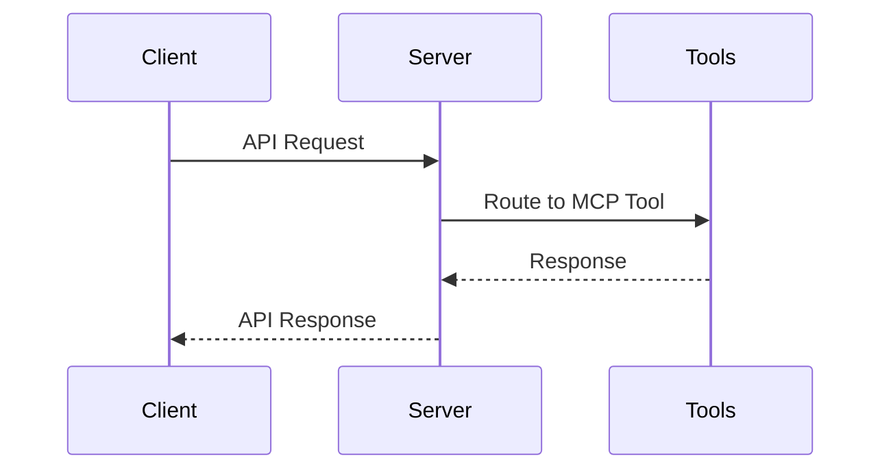
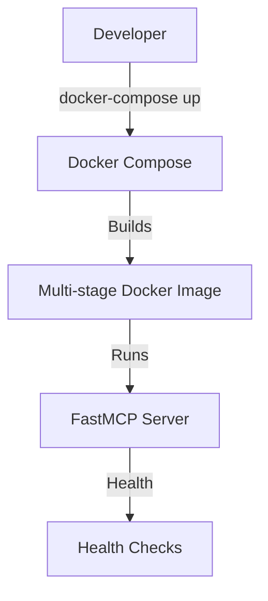

# FastMCP OpenAPI Server Architecture

## System Overview

```mermaid
flowchart TD
    Client-->|HTTP/WebSocket|FastMCP[FastMCP Server]
    FastMCP-->|OpenAPI Tools|Tools[Generated MCP Tools]
    FastMCP-->|Auth|Auth[Authentication Middleware]
    FastMCP-->|Config|Config[OpenAPI & Env Config]
    FastMCP-->|Docker|Docker[Dockerized Deployment]
```

## Authentication Flow

```mermaid
sequenceDiagram
    participant Client
    participant Server
    participant Auth
    Client->>Server: Request with Bearer Token
    Server->>Auth: Validate Token
    Auth-->>Server: Valid/Invalid
    Server-->>Client: Response/Error
```

## Request/Response Flow

```mermaid
sequenceDiagram
    participant Client
    participant Server
    participant Tools
    Client->>Server: API Request
    Server->>Tools: Route to MCP Tool
    Tools-->>Server: Response
    Server-->>Client: API Response
```

## Docker Deployment

```mermaid
flowchart TD
    Dev[Developer]-->|docker-compose up|Docker[Docker Compose]
    Docker-->|Builds|Image[Multi-stage Docker Image]
    Image-->|Runs|Server[FastMCP Server]
    Server-->|Health|Health[Health Checks]
```
