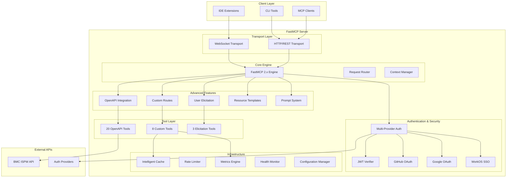
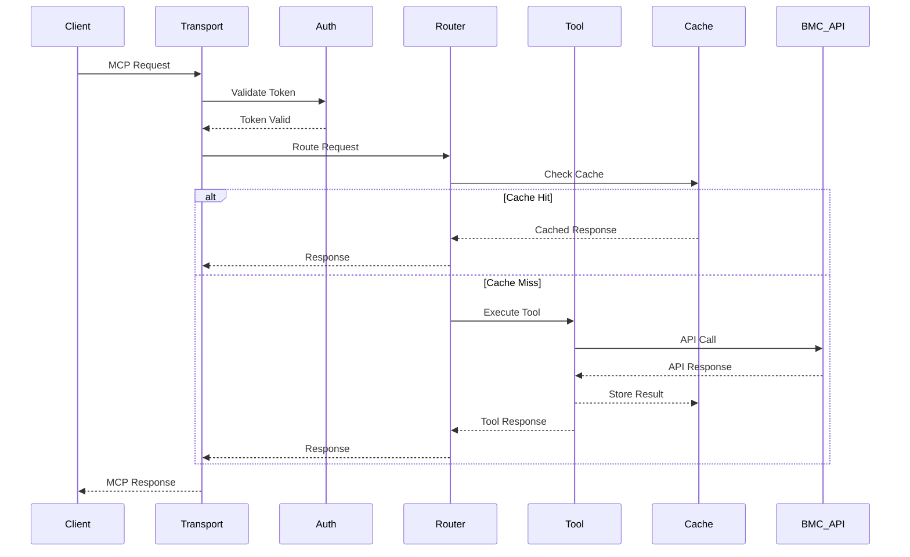
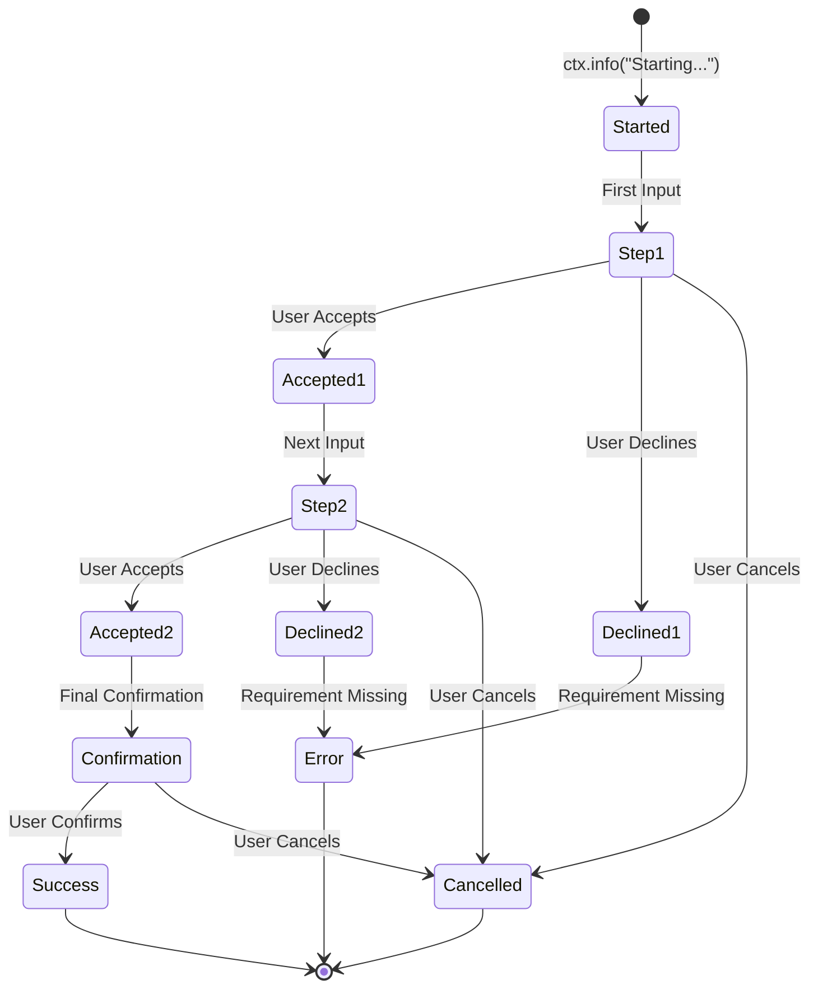
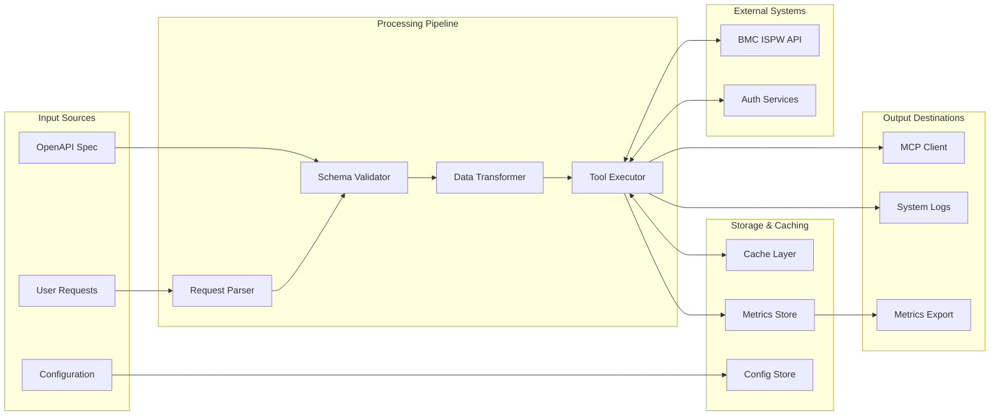
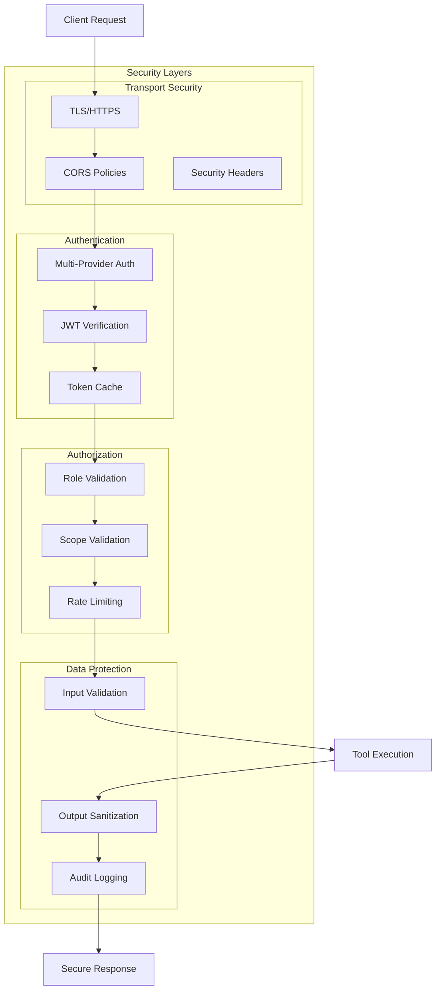
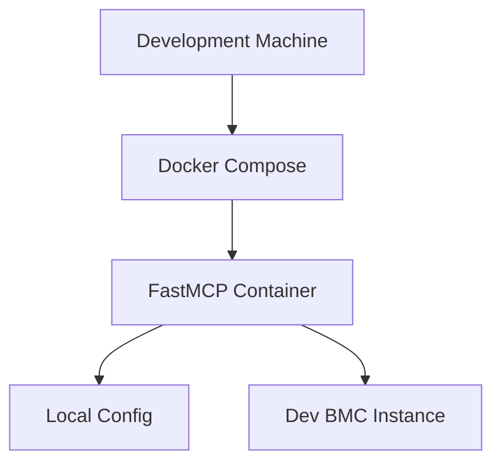
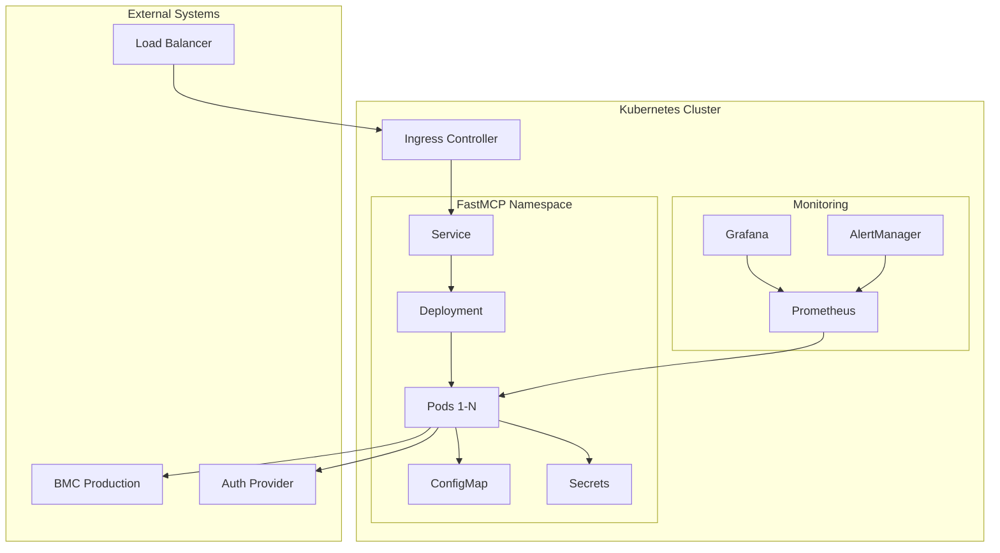
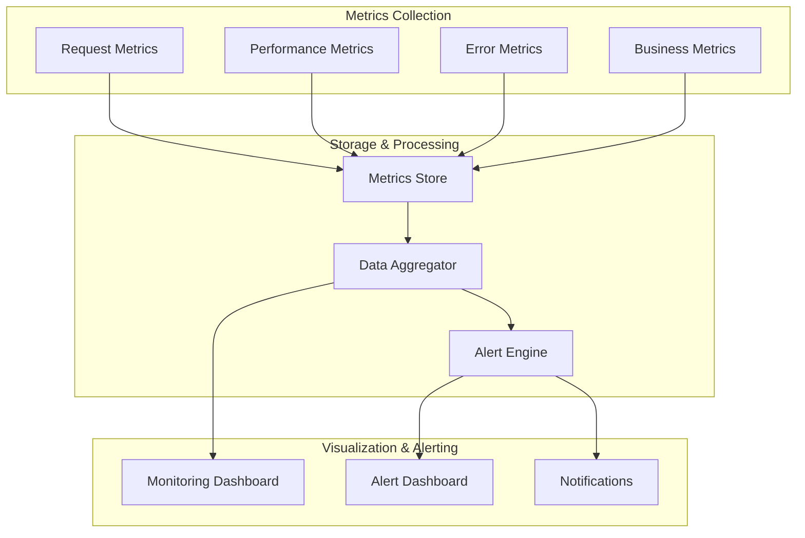

# BMC AMI DevX Code Pipeline MCP Server - Architecture

## 🏗️ **System Overview**

The BMC AMI DevX Code Pipeline MCP Server is a production-ready FastMCP 2.x compliant server that provides comprehensive mainframe DevOps integration through the Model Context Protocol.

## 🔧 **Component Architecture**

### **1. Transport Layer**
- **HTTP/REST Transport**: Primary MCP communication protocol
- **WebSocket Support**: Real-time streaming for long-running operations
- **Health Endpoints**: `/health`, `/status`, `/metrics`, `/ready`

### **2. Authentication & Security**
- **Multi-Provider Authentication**: JWT, GitHub, Google, WorkOS
- **Token Validation**: JWKS-based JWT verification
- **Rate Limiting**: Token bucket algorithm with per-user limits
- **Security Headers**: CORS, content security policies

### **3. FastMCP Engine**
- **Request Routing**: Intelligent request distribution
- **Context Management**: User context and session handling
- **Error Handling**: Comprehensive error recovery
- **Configuration Management**: Environment-based settings

### **4. Advanced Features**

#### **OpenAPI Integration**
- **Automatic Tool Generation**: 20+ tools from BMC ISPW API spec
- **Type-Safe Parameters**: Schema-based validation
- **Always in Sync**: API changes automatically reflected
- **Complete Coverage**: All BMC ISPW operations available

#### **User Elicitation System**
- **Interactive Workflows**: Multi-step user input collection
- **3 Elicitation Tools**: Assignment creation, deployment, troubleshooting
- **Response Handling**: Accept/Decline/Cancel pattern matching
- **Safety Features**: Production deployment warnings

#### **Custom Routes**
- **Health Monitoring**: Real-time server status
- **Metrics Endpoint**: Performance and usage statistics
- **Status Dashboard**: System health visualization
- **Readiness Probes**: Container orchestration support

#### **Resource Templates**
- **Parameterized Access**: `bmc://assignments/{srid}`
- **Template System**: Reusable resource definitions
- **Dynamic Content**: Context-aware resource generation

#### **Prompt System**
- **LLM Guidance**: Reusable templates for AI assistants
- **Analysis Prompts**: Assignment status analysis
- **Planning Prompts**: Deployment planning guidance
- **Troubleshooting Prompts**: Diagnostic guidance

### **5. Tool Architecture**

```mermaid
graph TD
    subgraph "Tool Categories"
        subgraph "OpenAPI Generated (20 tools)"
            A1[Assignment Management]
            A2[Release Operations]
            A3[Package Management]
            A4[Build Operations]
            A5[Deployment Control]
        end
        
        subgraph "Custom Management (8 tools)"
            M1[Server Metrics]
            M2[Health Status]
            M3[Cache Management]
            M4[Configuration]
            M5[Monitoring Tools]
        end
        
        subgraph "Interactive Elicitation (3 tools)"
            E1[Assignment Creation]
            E2[Release Deployment]
            E3[Issue Troubleshooting]
        end
    end
    
    A1 --> BMC_API[BMC ISPW API]
    A2 --> BMC_API
    A3 --> BMC_API
    A4 --> BMC_API
    A5 --> BMC_API
    
    M1 --> INTERNAL[Internal Systems]
    M2 --> INTERNAL
    M3 --> CACHE_SYS[Cache System]
    
    E1 --> USER_INPUT[User Interface]
    E2 --> USER_INPUT
    E3 --> USER_INPUT
```

## 🔄 **Request Flow Architecture**

## 🎯 **Elicitation Architecture**

## 📊 **Data Flow Architecture**

## 🔐 **Security Architecture**

## 🏭 **Deployment Architecture**

### **Development Environment**

### **Production Environment**

## 📈 **Performance Architecture**

### **Caching Strategy**
- **Multi-Level Caching**: Request, response, and metadata caching
- **TTL Management**: Time-based cache invalidation
- **LRU Eviction**: Memory-efficient cache management
- **Cache Warming**: Proactive cache population

### **Rate Limiting**
- **Token Bucket Algorithm**: Smooth rate limiting
- **Per-User Limits**: Individual user quotas
- **Burst Handling**: Short-term burst allowance
- **Graceful Degradation**: Proper rate limit responses

### **Connection Management**
- **Connection Pooling**: Efficient HTTP connections
- **Keep-Alive**: Persistent connections
- **Timeout Management**: Request timeout handling
- **Circuit Breaker**: Failure protection

## 🔍 **Monitoring Architecture**

## 🎛️ **Configuration Architecture**

- **Environment-Based Configuration**: Development, staging, production configs
- **Hierarchical Settings**: Global, environment, and local overrides
- **Secret Management**: Secure credential handling
- **Hot Reloading**: Dynamic configuration updates
- **Validation**: Configuration schema validation

## 🔄 **Integration Architecture**

The server integrates seamlessly with:
- **BMC ISPW API**: Complete mainframe DevOps operations
- **Authentication Providers**: JWT, GitHub, Google, WorkOS
- **Container Orchestration**: Docker, Kubernetes
- **Monitoring Systems**: Prometheus, Grafana
- **CI/CD Pipelines**: GitHub Actions, GitLab CI
- **Development Tools**: VSCode, IntelliJ, CLI tools

This architecture provides a robust, scalable, and maintainable foundation for mainframe DevOps integration through the Model Context Protocol using FastMCP 2.x standards.